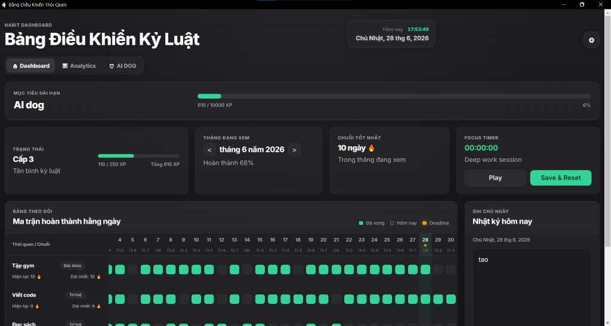
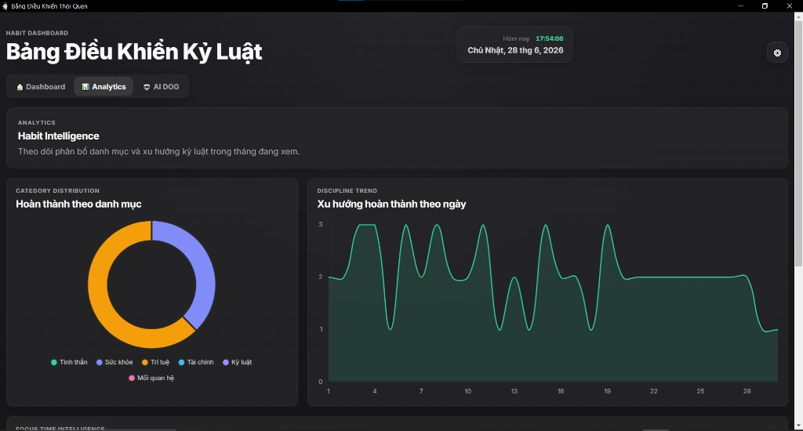
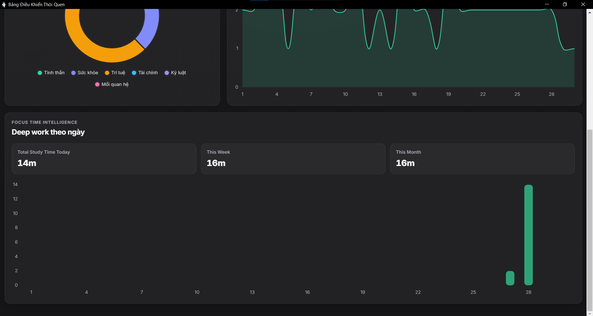
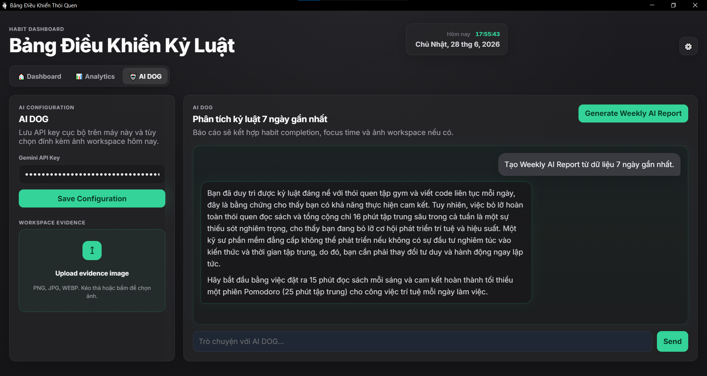

# 🌟 Bảng Điều Khiển Kỷ Luật (Habit Tracker Dashboard)
## Dự án này được phát triển độc lập với mục tiêu áp dụng kiến trúc Client-Server nội bộ, quản lý State và tích hợp AI vào một ứng dụng thực tế. 

## ✨ Tính năng nổi bật

* **📊 Ma trận thói quen động:** Theo dõi tiến độ hàng ngày với giao diện trực quan. Hỗ trợ thêm, sửa, xóa và phân loại thói quen theo các danh mục động (Sức khỏe, Trí tuệ, Kỷ luật,...).
* **⚔️ Hệ thống Gamification:** Tích hợp thanh Kinh nghiệm (XP) và Cấp độ (VD: "Tân binh kỷ luật"). Duy trì chuỗi (streak) càng dài, cấp độ càng cao.
*  ( có thể không quan tâm )
* **📓 Nhật ký bối cảnh (Daily Journal):** Ghi chép lý do, cảm xúc hoặc sự kiện của từng ngày. Dữ liệu được lưu trữ an toàn, độc lập dưới dạng Local Persistent Storage.
 
* **⏱️ Focus Timer (Phiên làm việc sâu):** Tích hợp đồng hồ Pomodoro giúp tập trung cao độ khi viết code hoặc học tập.
 
* **🤖 Trợ lý AI Phân tích (Gemini Integration):** Kết nối trực tiếp với API của Google Gemini để tự động đọc biểu đồ, phân tích hành vi và đưa ra báo cáo "AI Dog" hàng tuần.
 
* **🎨 Premium UI/UX:** Giao diện Dark Mode hiện đại với hiệu ứng Emerald Glow, thiết kế UX tinh gọn và có phản hồi thị giác (Visual Feedback) rõ ràng.

## 🛠️ Công nghệ sử dụng

* **Frontend:** HTML5, CSS3, Vanilla JavaScript (DOM Manipulation).
* **Backend (Cục bộ):** Node.js, Electron.js (Main Process & IPC Bridge).
* **Quản lý dữ liệu:** Lưu trữ Local Storage / File JSON cục bộ.
* **Thư viện tích hợp:** Chart.js (Vẽ biểu đồ Analytics), API Google Gemini (AI).
* **Đóng gói (Packaging):** `electron-builder` (Xuất file `.exe` cho Windows).

## 🚀 Hướng dẫn cài đặt và chạy thử (Dành cho Nhà phát triển)

Đảm bảo máy tính của bạn đã cài đặt [Node.js](https://nodejs.org/). Sau đó, chạy các lệnh sau trong Terminal:

1. **Clone dự án và di chuyển vào thư mục:**
   ```bash
   git clone <link-github-cua-ban>
   cd habit-tracker
Cài đặt các thư viện cần thiết (Dependencies):

Bash
npm install

Khởi chạy ứng dụng trong môi trường phát triển (Development):

Bash
npm start

📦 Đóng gói xuất xưởng (Production Build)
Để tạo ra file cài đặt .exe độc lập sử dụng trên môi trường Windows (không cần cài đặt Node.js):

Bash
npm run build

Lưu ý: File .exe sau khi build thành công sẽ nằm trong thư mục dist/.

🧠 Kiến trúc hệ thống

Ứng dụng tuân thủ nghiêm ngặt mô hình bảo mật của Electron:

Renderer Process (renderer.js): Xử lý giao diện người dùng, gọi API bên ngoài (Gemini) và hiển thị dữ liệu động. Tuyệt đối không can thiệp vào hệ thống máy tính.

Main Process (main.js): Chạy trên nền Node.js, quản lý vòng đời ứng dụng, cấp quyền và thao tác đọc/ghi file lưu trữ.

Context Isolation: Giao tiếp giữa Frontend và Backend cục bộ được thực hiện hoàn toàn qua luồng IPC (Inter-Process Communication) an toàn.

Phát triển bởi Trương Minh Tú và AI Dog | Sinh viên ngành Kỹ thuật Máy tính tại Trường Đại học Công nghệ Thông tin (UIT) - Đam mê theo đuổi lĩnh vực Software Engineering và Web Development. 
